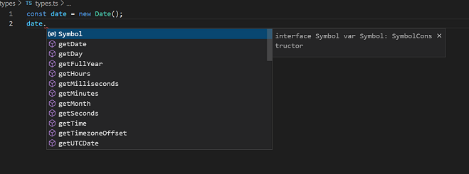
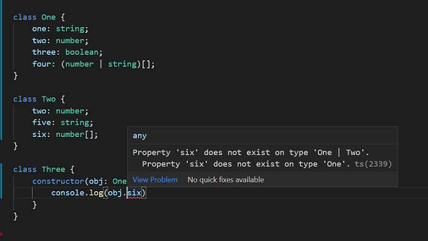

# typescript-udemy

Learning Typescript from Udemy course by Stephen Grider

- fetchjson
  mkdir fetchjson

npm init -y

npm i axios

- what is types?
  easy way to refer different properties and functions attached with the value/variable has

when we give a type to a variable then we can get all the hints related to all the functions we can use with that variable.



- install parcel-bundler
  `npm i -g parcel-bundler`
  helps in running .ts files directly from browser.

command to run app -> `parcel <html_file_with_.ts_file_in_script_src>`

```
Note:

If we have two classes namely One and Two and another class three in whose constructor we try to pass an argument in its constructor which is recieved as -> "paramObj: One | Two" then paramObj can have access to only common properties(variable, functions) of the two classes (One|Two)
```



- working with express

express - framework to help write web based applications

body parser - package to help parse information sent in forms

cookie-session - package to help store information about users in cookies.

`npm i concurrently nodemon`

`npm i express cookie-session body-parser`

`npm i @types/express @types/cookie-session @types/body-parser`

- npm sripts required

```json
"scripts": {
		"start:build": "tsc -w",
		"start:run": "nodemon build/index.js",
		"start": "concurrently npm:start:*"
	}
```
