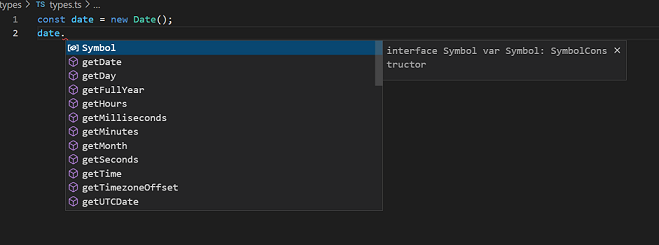

# typescript-udemy
Learning Typescript from Udemy course by Stephen Grider

* fetchjson
mkdir fetchjson

npm init -y

npm i axios

* what is types?
easy way to refer different properties and functions attached with the value/variable has

when we give a type to a variable then we can get all the hints related to all the functions we can use with that variable.

